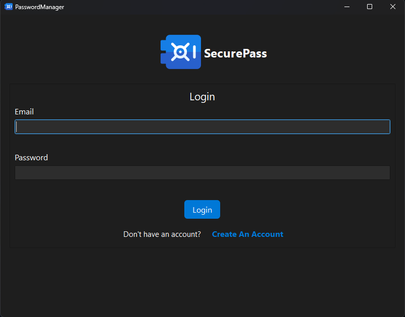
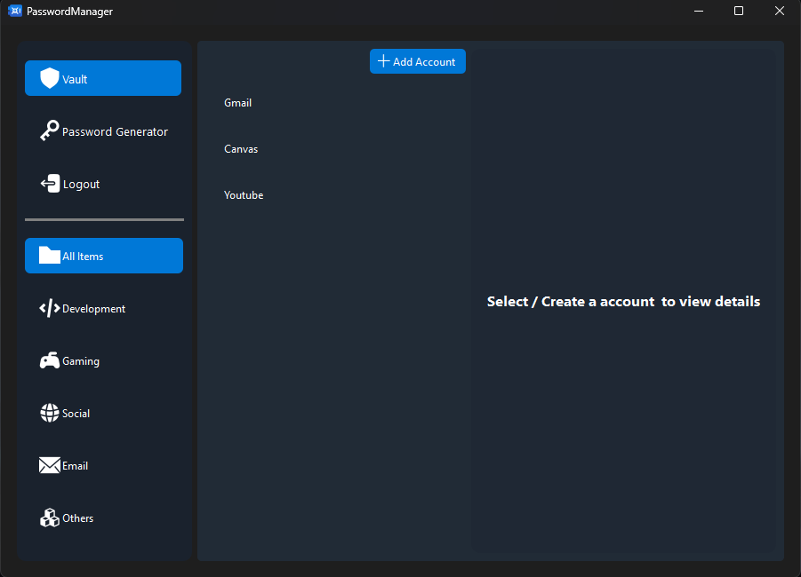
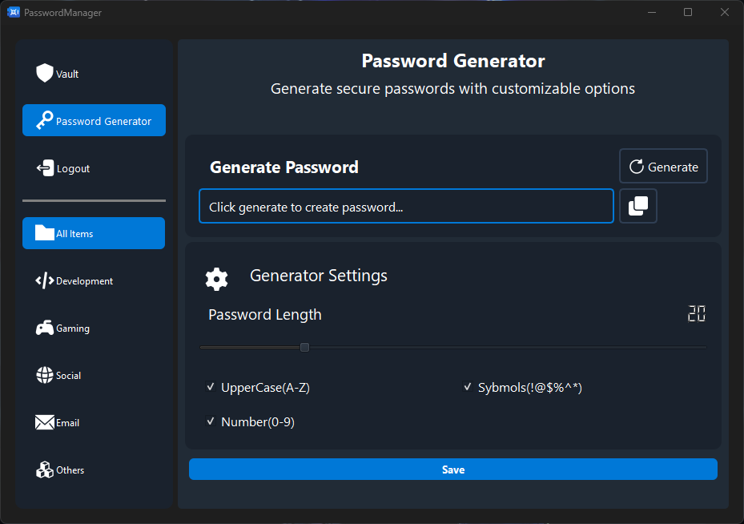

# 🔐 Secure Pass – Qt & C++ Password Manager

**Secure Pass** is a fast, secure, and offline-first password manager built with **C++** and **Qt**. It uses AES encryption to keep your credentials safe, fully offline. Organize your logins, generate strong passwords, and stay in control of your data.

---

## 🚀 Features

- ✅ **Offline-Only Storage** – No internet access required; all data stays local.
- 🔒 **AES-256 Local Encryption** – Your passwords are encrypted securely on disk using the Advanced Encryption Standard.
- 🔑 **Built-in Password Generator** – Easily create strong, random passwords.
- ⚡ **Auto Password Suggestion** – Automatically generates a password when adding new entries.
- 🗂️ **Category-Based Sorting** – Organize credentials by categories like Email, Social Media, Work, etc.
- 💻 **Cross-Platform UI** – Seamless experience across Windows, Linux, and macOS with Qt.

---

## 📸 Preview

---

## 🛠️ Tech Stack

- **Language:** C++
- **UI Framework:** Qt 6 / Qt 5 (Widgets or QML)
- **Encryption:** AES-256
- **Build System:** CMake

---
